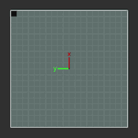
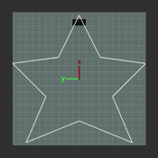

# Grid Map

## Overview

This is a C++ library with [ROS] interface to manage two-dimensional grid maps with multiple data layers. It is designed for mobile robotic mapping to store data such as elevation, variance, color, friction coefficient, foothold quality, surface normal, traversability etc. It is used in the [Robot-Centric Elevation Mapping](https://github.com/ethz-asl/elevation_mapping) package designed rough terrain navigation.

Features:

* **Multi-layered:** Developed for universal 2.5-dimensional grid mapping with support for any number of layers.
* **Efficient map re-positioning:** Data storage is implemented as two-dimensional circular buffer. This allows for non-destructive shifting of the map's position (e.g. to follow the robot) without copying data in memory.
* **Based on Eigen:** Grid map data is stored as [Eigen] data types. Users can apply available Eigen algorithms directly to the map data for versatile and efficient data manipulation.
* **Convenience functions:** Several helper methods allow for convenient and memory safe cell data access. For example, iterator functions for rectangular, circular, polygonal regions and lines are implemented.
* **ROS interface:** Grid maps can be directly converted to ROS message types such as PointCloud2, OccupancyGrid, GridCells, and our custom GridMap message.
* **Visualizations:** The *grid_map_visualization* package helps to visualize grid maps in various form in [RViz].

The grid map package has been tested under [ROS] Indigo and Ubuntu 14.04. This is research code, expect that it changes often and any fitness for a particular purpose is disclaimed.

The source code is released under a [BSD 3-Clause license](LICENSE).

**Author: Péter Fankhauser, pfankhauser@ethz.ch 
Affiliation: Autonomous Systems Lab, ETH Zurich**

## Publications

If you use this work in an academic context, please cite the following publication(s):

* P. Fankhauser, M. Bloesch, C. Gehring, M. Hutter, and R. Siegwart,
**"Robot-Centric Elevation Mapping with Uncertainty Estimates"**,
in International Conference on Climbing and Walking Robots (CLAWAR), 2014. ([PDF](http://dx.doi.org/10.3929/ethz-a-010173654))

        @inproceedings{Fankhauser2014RobotCentricElevationMapping,
            author = {Fankhauser, Péter and Bloesch, Michael and Gehring, Christian and Hutter, Marco and Siegwart, Roland},
            title = {Robot-Centric Elevation Mapping with Uncertainty Estimates},
            booktitle = {International Conference on Climbing and Walking Robots (CLAWAR)},
            year = {2014}
        }

## Installation

### Dependencies

Except for ROS packages that are part of the standard installation (*cmake-modules*, *roscpp*, *sensor_msgs*, and *nav_msgs*), the grid map library depends only on the linear algebra library [Eigen].

    sudo apt-get install libeigen3-dev

### Building

To install, clone the latest version from this repository into your catkin workspace and compile the package using

    cd catkin_ws/src
    git clone https://github.com/ethz-asl/grid_map.git
    cd ../
    catkin_make
    

### Packages Overview

This repository consists of following packages:

* ***grid_map_core*** implements the algorithms of the grid map library. It provides the `GridMap` class and several helper classes such as the iterators. This package is implemented without [ROS] dependencies.
* ***grid_map*** is the main package for [ROS] dependent projects using the grid map library. It provides the interfaces to convert the base classes to several ROS] message types.
* ***grid_map_msgs*** holds the [ROS] message and service definitions around the [grid_map_msg/GridMap] message type.
* ***grid_map_visualization*** contains a node written to convert GridMap messages to other [ROS] message types for visualization in [RViz]. The visualization parameters are configurable through [ROS] parameters.
* ***grid_map_filters*** TODO
* ***grid_map_demos*** contains several nodes for demonstration purposes. The *simple_demo* node demonstrates a simple example for using the grid map library. An extended demonstration of the library's functionalities is given in the *tutorial_demo* node. Finally, the *iterators_demo* showcases the usage of the grid map iterators.

### Unit Tests

Run the unit tests with

    catkin_make run_tests_grid_map_core run_tests_grid_map_core
    catkin_make run_tests_grid_map run_tests_grid_map
    

## Usage

### Conventions & Definitions

### Iterators

The grid map library contains various iterators for convenience.

Grid map | Submap | Circle | Line | Polygon
--- | --- | --- | --- | ---
 |  |  |  | 

The simplest way to iterate over the entire grid map is to use the `GridMapIterator` as

    for (grid_map_lib::GridMapIterator iterator(map); !iterator.isPassedEnd(); ++iterator) {
        cout << "The value at index " << *iterator << " is " << map.at("type", *iterator) << endl;
    }

You can find more examples on how to use the different interators in the [GridMapExample] file.

## Nodes

### Node: grid_map_lib

ROS-independent implementation of the grid map algorithms.

### Node: grid_map

ROS interfaces and conversions for the `grid_map_lib`.

### Node: grid_map_visualization

This node subscribes to a grid map topic and publishes messages that can be visualized in [rviz].

Point cloud | Occupancy grid
--- | ---
 | 

#### Subscribed Topics

* **`/grid_map`** ([grid_map_msg/GridMap])

    The grid map to visualize.

#### Published Topics

* **`point_cloud`** ([sensor_msgs/PointCloud2])

    TODO.

* **`region`** ([visualization_msgs/Marker])

    TODO.

* **`vector`** ([visualization_msgs/Marker])

    TODO.
    
* **`occupancy_grid`** ([nav_msgs/OccupancyGrid])
    
    TODO.

#### Parameters

*Note: Color values are in RGB form as concatenated integers (for each channel value 0-255). The values can be generated like [this](http://www.wolframalpha.com/input/?i=BitOr%5BBitShiftLeft%5Br%2C16%5D%2C+BitShiftLeft%5Bg%2C8%5D%2C+b%5D+where+%7Br%3D0%2C+g%3D255%2C+b%3D0%7D) as an example for the color green (red: 0, green: 255, blue: 0).*

* **`grid_map_topic`** (string, default: "/grid_map")
 
    The name of the grid map topic to be visualized.

* **`point_cloud/point_type`** (string)
 
    The type of the grid map to be transformed to the 3d points of the point cloud.

* **`map_region/line_width`** (double, default: 0.003)
 
    The line width of the map region marker (in m).

* **`map_region/color`** (int, default: 16777215 (white))
 
    The color of the map region visualization.

* **`vector/type_prefix`** (string)
 
    Prefix of the types that are transformed to the vector value. The types with endings `x`, `y`, and `z` have to exist.

* **`vector/position_type`** (string)
 
    The type of the grid map that is used as starting points of the vectors.

* **`vector/scale`** (double, default: 0.03)
 
    Scaling of the vectors.

* **`vector/line_width`** (double, default: 0.001)
 
    The line width of the vectors.

* **`vector/color`** (int, default: 16777215 (white))
 
    The color of the vectors.

### Package: grid_map_msg

Definition of the grid map message type and services.

* **`GridMapInfo`** ([grid_map_msg/GridMapInfo])

    Definition of the grid map meta information message type.

* **`GridMap`** ([grid_map_msg/GridMap])

    Definition of the grid map message type.

* **`GetGridMap`** ([grid_map_msg/GetGridMap])

    Definition of the service call for requesting a grid map.

## Bugs & Feature Requests

Please report bugs and request features using the [Issue Tracker](https://github.com/ethz-asl/grid_map/issues).

[ROS]: http://www.ros.org
[RViz]: http://wiki.ros.org/rviz
[Eigen]: http://eigen.tuxfamily.org
[grid_map_msg/GridMapInfo]: grid_map_msg/msg/GridMapInfo.msg
[grid_map_msg/GridMap]: grid_map_msg/msg/GridMap.msg
[grid_map_msg/GetGridMap]: grid_map_msg/srv/GetGridMap.srv
[GridMapExample]: grid_map_example/src/GridMapExample.cpp
[sensor_msgs/PointCloud2]: http://docs.ros.org/api/sensor_msgs/html/msg/PointCloud2.html
[visualization_msgs/Marker]: http://docs.ros.org/api/visualization_msgs/html/msg/Marker.html
[geometry_msgs/PolygonStamped]: http://docs.ros.org/api/geometry_msgs/html/msg/PolygonStamped.html
[nav_msgs/OccupancyGrid]: http://docs.ros.org/api/nav_msgs/html/msg/OccupancyGrid.html
