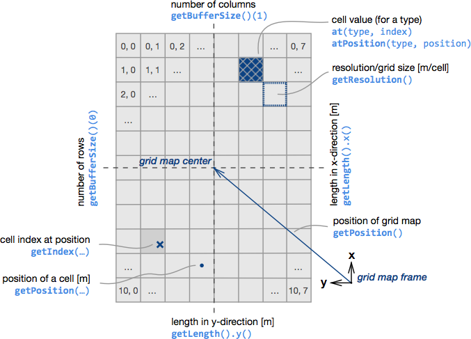

Grid Map
======================

Overview
---------------

This is a C++ library to manage two-dimensional grid maps with multiple data layers. It is designed with mobile robots in mind and typical usage including storing local data such as `elevation`, `variance`, `color`, `friction_coefficient`, `quality`, `surface_normal_x`, `surface_normal_y`, `surface_normal_z` etc. It is used in the [Robot-Centric Elevation Mapping](https://github.com/ethz-asl/elevation_mapping) framework.

The storage structure is implemented as two-dimensional circular buffer so the map can be moved efficiently while the data keeps its correspodance to a fixed reference frame. This library builds on the [Eigen] library and provides interfaces and message definitions for [ROS]. Currently, only float data can be stored in the grid map.

**Author: Péter Fankhauser, pfankhauser@ethz.ch 
Affiliation: Autonomous Systems Lab, ETH Zurich**

Citing
---------------

The methods used in this software are described in the following paper (available [here](http://dx.doi.org/10.3929/ethz-a-010173654)):

P. Fankhauser, M. Bloesch, C. Gehring, M. Hutter, and R. Siegwart,
**"Robot-Centric Elevation Mapping with Uncertainty Estimates"**,
in International Conference on Climbing and Walking Robots (CLAWAR), 2014.

    @inproceedings{Fankhauser2014RobotCentricElevationMapping,
      author = {Fankhauser, Péter and Bloesch, Michael and Gehring, Christian and Hutter, Marco and Siegwart, Roland},
      title = {Robot-Centric Elevation Mapping with Uncertainty Estimates},
      booktitle = {International Conference on Climbing and Walking Robots (CLAWAR)},
      year = {2014}
    }

Installation
------------

### Dependencies

- [Eigen](http://eigen.tuxfamily.org) (linear algebra library).

### Building

In order to install, clone the latest version from this repository into your catkin workspace and compile the package using

    cd catkin_workspace/src
    git clone https://github.com/ethz-asl/grid_map.git
    cd ../
    catkin_make

### Unit Tests

Run the unit tests with

    catkin_make run_tests_grid_map_lib run_tests_grid_map_lib

Usage
------------

### Conventions & Definitions

### Iterators

 |  | | | 
--- | --- | ---
Grid map iterator | Submap iterator | Circle iterator | Line iterator | Polygon iterator

Nodes
------------

### Node: grid_map_lib

ROS-independent implementation of the grid map algorithms.

### Node: grid_map

ROS interfaces and conversions for the `grid_map_lib`.

### Node: grid_map_visualization

This node subscribes to a grid map topic and publishes messages that can be visualized in [rviz].

#### Subscribed Topics

* **`/grid_map`** ([grid_map_msg/GridMap])

    The grid map to visualize.

#### Published Topics

* **`point_cloud`** ([sensor_msgs/PointCloud2])

    TODO.

* **`region`** ([visualization_msgs/Marker])

    TODO.

* **`vector`** ([visualization_msgs/Marker])

    TODO.

#### Parameters

*Note: Color values are in RGB form as concatenated integers (for each channel value 0-255). The values can be generated like [this](http://www.wolframalpha.com/input/?i=BitOr%5BBitShiftLeft%5Br%2C16%5D%2C+BitShiftLeft%5Bg%2C8%5D%2C+b%5D+where+%7Br%3D0%2C+g%3D255%2C+b%3D0%7D) as an example for the color green (red: 0, green: 255, blue: 0).*

* **`grid_map_topic`** (string, default: "/grid_map")
 
    The name of the grid map topic to be visualized.

* **`point_cloud/point_type`** (string)
 
    The type of the grid map to be transformed to the 3d points of the point cloud.

* **`map_region/line_width`** (double, default: 0.003)
 
    The line width of the map region marker (in m).

* **`map_region/color`** (int, default: 16777215 (white))
 
    The color of the map region visualization.

* **`vector/type_prefix`** (string)
 
    Prefix of the types that are transformed to the vector value. The types with endings `x`, `y`, and `z` have to exist.

* **`vector/position_type`** (string)
 
    The type of the grid map that is used as starting points of the vectors.

* **`vector/scale`** (double, default: 0.03)
 
    Scaling of the vectors.

* **`vector/line_width`** (double, default: 0.001)
 
    The line width of the vectors.

* **`vector/color`** (int, default: 16777215 (white))
 
    The color of the vectors.

### Package: grid_map_msg

Definition of the grid map message type and services.

* **`GridMapInfo`** ([grid_map_msg/GridMapInfo])

    Definition of the grid map meta information message type.

* **`GridMap`** ([grid_map_msg/GridMap])

    Definition of the grid map message type.

* **`GetGridMap`** ([grid_map_msg/GetGridMap])

    Definition of the service call for requesting a grid map.

Bugs & Feature Requests
------------

Please report bugs and request features using the [Issue Tracker](https://github.com/ethz-asl/grid_map/issues).

[ROS]: http://www.ros.org
[Eigen]: http://eigen.tuxfamily.org
[grid_map_msg/GridMapInfo]: grid_map_msg/msg/GridMapInfo.msg
[grid_map_msg/GridMap]: grid_map_msg/msg/GridMap.msg
[grid_map_msg/GetGridMap]: grid_map_msg/srv/GetGridMap.srv
[sensor_msgs/PointCloud2]: http://docs.ros.org/api/sensor_msgs/html/msg/PointCloud2.html
[visualization_msgs/Marker]: http://docs.ros.org/api/visualization_msgs/html/msg/Marker.html
[geometry_msgs/PolygonStamped]: http://docs.ros.org/api/geometry_msgs/html/msg/PolygonStamped.html
