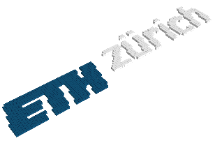
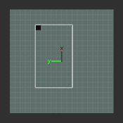
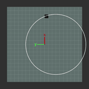
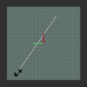
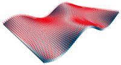
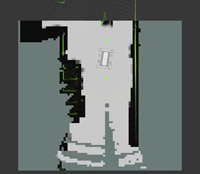

# Grid Map

## Overview

This is a C++ library with [ROS] interface to manage two-dimensional grid maps with multiple data layers. It is designed for mobile robotic mapping to store data such as elevation, variance, color, friction coefficient, foothold quality, surface normal, traversability etc. It is used in the [Robot-Centric Elevation Mapping](https://github.com/ethz-asl/elevation_mapping) package designed for rough terrain navigation.

Features:

* **Multi-layered:** Developed for universal 2.5-dimensional grid mapping with support for any number of layers.
* **Efficient map re-positioning:** Data storage is implemented as two-dimensional circular buffer. This allows for non-destructive shifting of the map's position (e.g. to follow the robot) without copying data in memory.
* **Based on Eigen:** Grid map data is stored as [Eigen] data types. Users can apply available Eigen algorithms directly to the map data for versatile and efficient data manipulation.
* **Convenience functions:** Several helper methods allow for convenient and memory safe cell data access. For example, iterator functions for rectangular, circular, polygonal regions and lines are implemented.
* **ROS interface:** Grid maps can be directly converted to ROS message types such as PointCloud2, OccupancyGrid, GridCells, and our custom GridMap message.
* **Visualizations:** The *grid_map_visualization* package helps to visualize grid maps in various form in [RViz].

The grid map package has been tested under [ROS] Indigo and Ubuntu 14.04. This is research code, expect that it changes often and any fitness for a particular purpose is disclaimed.

The source code is released under a [BSD 3-Clause license](LICENSE).

**Authors: Péter Fankhauser, Martin Wermelinger 
Maintainer: Péter Fankhauser, pfankhauser@ethz.ch 
Affiliation: Autonomous Systems Lab, ETH Zurich**

## Publications

If you use this work in an academic context, please cite the following publication(s):

* P. Fankhauser and M. Hutter,
**"A Universal Grid Map Library: Implementation and Use Case for Rough Terrain Navigation"**,
in Robot Operating System (ROS) – The Complete Reference (Volume 1), A. Koubaa (Ed.), Springer, 2016. ([PDF](http://www.researchgate.net/publication/284415855))

        @incollection{Fankhauser2016GridMapLibrary,
            author = {Fankhauser, Péter and Hutter, Marco},
            booktitle = {Robot Operating System (ROS) – The Complete Reference (Volume 1)},
            title = {{A Universal Grid Map Library: Implementation and Use Case for Rough Terrain Navigation}},
            chapter = {5},
            editor = {Koubaa, Anis},
            publisher = {Springer},
            year = {2016},
            isbn = {978-3-319-26052-5},
            doi = {10.1007/978-3-319-26054-9{\_}5},
            url = {http://www.springer.com/de/book/9783319260525}
        }

## Installation

### Dependencies

Except for ROS packages that are part of the standard installation (*roscpp*, *tf*, *filters*, *sensor_msgs*, *nav_msgs*, and *cv_bridge*), the grid map library depends only on the linear algebra library [Eigen].

    sudo apt-get install libeigen3-dev

### Building

To install, clone the latest version from this repository into your catkin workspace and compile the package using

    cd catkin_ws/src
    git clone https://github.com/ethz-asl/grid_map.git
    cd ../
    catkin_make
    
To maximize performance, make sure to build in *Release* mode. You can specify the build type by setting

    catkin_make -DCMAKE_BUILD_TYPE=Release
    

### Packages Overview

This repository consists of following packages:

* ***grid_map_core*** implements the algorithms of the grid map library. It provides the `GridMap` class and several helper classes such as the iterators. This package is implemented without [ROS] dependencies.
* ***grid_map*** is the main package for [ROS] dependent projects using the grid map library. It provides the interfaces to convert the base classes to several [ROS] message types.
* ***grid_map_msgs*** holds the [ROS] message and service definitions around the [grid_map_msg/GridMap] message type.
* ***grid_map_visualization*** contains a node written to convert GridMap messages to other [ROS] message types for visualization in [RViz]. The visualization parameters are configurable through [ROS] parameters.
* ***grid_map_filters*** builds on the ROS [filters](http://wiki.ros.org/filters) package to process grid maps as a sequence of filters. 
* ***grid_map_demos*** contains several nodes for demonstration purposes.

### Unit Tests

Run the unit tests with

    catkin_make run_tests_grid_map_core run_tests_grid_map
    

## Usage

### Demonstrations

The *grid_map_demos* package contains several demonstration nodes. Use this code to verify your installation of the grid map packages and to get you started with own usage of the library.

* *[simple_demo](grid_map_demos/src/simple_demo_node.cpp)* demonstrates a simple example for using the grid map library. This ROS node creates a grid map, adds data to it, and publishes it. To see the result in RViz, execute the command

        roslaunch grid_map_demos simple_demo.launch
        
* *[tutorial_demo](grid_map_demos/src/tutorial_demo_node.cpp)* is an extended demonstration of the library's functionalities. Launch the *tutorial_demo* with
        
        roslaunch grid_map_demos tutorial_demo.launch

* *[iterators_demo](grid_map_demos/src/IteratorsDemo.cpp)* showcases the usage of the grid map iterators. Launch it with

        roslaunch grid_map_demos iterators_demo.launch
        
* *[image_to_gridmap_demo](grid_map_demos/src/ImageToGridmapDemo.cpp)* demonstrates how to convert data from an [image](grid_map_demos/scripts/example_image.png) to a grid map. Start the demonstration with
        
        roslaunch grid_map_demos image_to_gridmap_demo.launch

    

### Conventions & Definitions

### Iterators

The grid map library contains various iterators for convenience.

Grid map | Submap | Circle | Line | Polygon
--- | --- | --- | --- | ---
 |  |  |  | 

Using the iterator in a `for` loop is common. For example, iterate over the entire grid map with the `GridMapIterator` with

    for (grid_map::GridMapIterator iterator(map); !iterator.isPastEnd(); ++iterator) {
        cout << "The value at index " << *iterator << " is " << map.at("layer", *iterator) << endl;
    }

The other grid map iterators follow the same form. You can find more examples on how to use the different iterators in the *[iterators_demo](grid_map_demo/src/IteratorsDemo.cpp)* node.

## Nodes

### grid_map_visualization

This node subscribes to a topic of type [grid_map_msgs/GridMap] and publishes messages that can be visualized in [RViz]. The published topics of the visualizer can be fully configure with a YAML parameter file. Any number of visualizations with different parameters can be added. An example is [here](grid_map_demos/config/tutorial_demo.yaml) for the configuration file of the *tutorial_demo*.

Point cloud | Vectors | Occupancy grid | Grid cells
--- | --- | --- | ---
 |  |  | 

#### Parameters

* **`grid_map_topic`** (string, default: "/grid_map")

    The name of the grid map topic to be visualized. See below for the description of the visualizers.
    

#### Subscribed Topics

* **`/grid_map`** ([grid_map_msgs/GridMap])

    The grid map to visualize.

#### Published Topics

The published topics are configured with the [YAML parameter file](grid_map_demos/config/tutorial_demo.yaml). Possible topics are:

* **`point_cloud`** ([sensor_msgs/PointCloud2])

    Shows the grid map as a point cloud. Select which layer to transform as points with the `layer` parameter.

        name: elevation
        type: point_cloud
        params:
        layer: elevation

* **`vector`** ([visualization_msgs/Marker])

    Visualizes vector data of the grid map as visual markers. Specify the layers which hold the *x*-, *y*-, and *z*-components of the vectors with the `layer_prefix` parameter. The parameter `position_layer` defines the layer to be used as start point of the vectors.
    
        name: surface_normals
        type: vectors
        params:
         layer_prefix: normal_
         position_layer: elevation
         scale: 0.06
         line_width: 0.005
         color: 15600153 # red
    
* **`occupancy_grid`** ([nav_msgs/OccupancyGrid])

    Visualizes a layer of the grid map as occupancy grid. Specify the layer to be visualized with the `layer` parameter, and the upper and lower bound with `data_min` and `data_max`.
        
        name: traversability_grid
        type: occupancy_grid
        params:
         layer: traversability
         data_min: -0.15
         data_max: 0.15

* **`grid_cells`** ([nav_msgs/GridCells])

    Visualizes a layer of the grid map as grid cells. Specify the layer to be visualized with the `layer` parameter, and the upper and lower bounds with `lower_threshold` and `upper_threshold`.
    
        name: elevation_cells
        type: grid_cells
        params:
         layer: elevation
         lower_threshold: -0.08 # optional, default: -inf
         upper_threshold: 0.08 # optional, default: inf
    
* **`region`** ([visualization_msgs/Marker])
    
    Shows the boundary of the grid map.
    
        name: map_region
        type: map_region
        params:
         color: 3289650
         line_width: 0.003

*Note: Color values are in RGB form as concatenated integers (for each channel value 0-255). The values can be generated like [this](http://www.wolframalpha.com/input/?i=BitOr%5BBitShiftLeft%5Br%2C16%5D%2C+BitShiftLeft%5Bg%2C8%5D%2C+b%5D+where+%7Br%3D0%2C+g%3D255%2C+b%3D0%7D) as an example for the color green (red: 0, green: 255, blue: 0).*

## Bugs & Feature Requests

Please report bugs and request features using the [Issue Tracker](https://github.com/ethz-asl/grid_map/issues).

[ROS]: http://www.ros.org
[RViz]: http://wiki.ros.org/rviz
[Eigen]: http://eigen.tuxfamily.org
[grid_map_msgs/GridMapInfo]: grid_map_msg/msg/GridMapInfo.msg
[grid_map_msgs/GridMap]: grid_map_msg/msg/GridMap.msg
[grid_map_msgs/GetGridMap]: grid_map_msg/srv/GetGridMap.srv
[sensor_msgs/PointCloud2]: http://docs.ros.org/api/sensor_msgs/html/msg/PointCloud2.html
[visualization_msgs/Marker]: http://docs.ros.org/api/visualization_msgs/html/msg/Marker.html
[geometry_msgs/PolygonStamped]: http://docs.ros.org/api/geometry_msgs/html/msg/PolygonStamped.html
[nav_msgs/OccupancyGrid]: http://docs.ros.org/api/nav_msgs/html/msg/OccupancyGrid.html
[nav_msgs/GridCells]: http://docs.ros.org/api/nav_msgs/html/msg/GridCells.html
